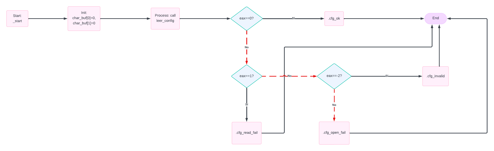
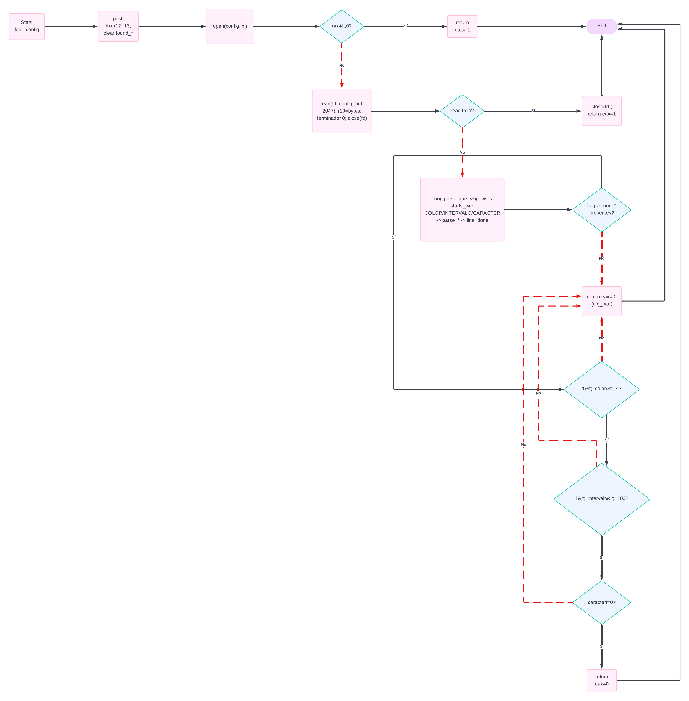
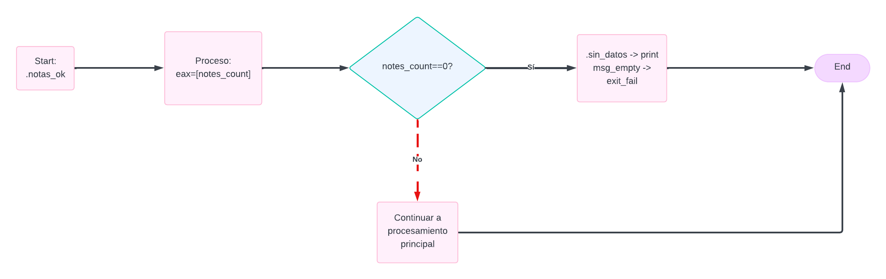
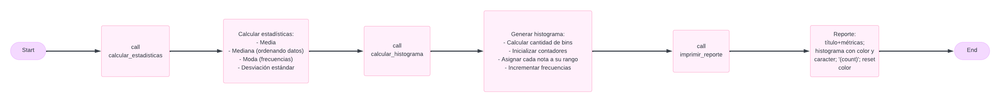
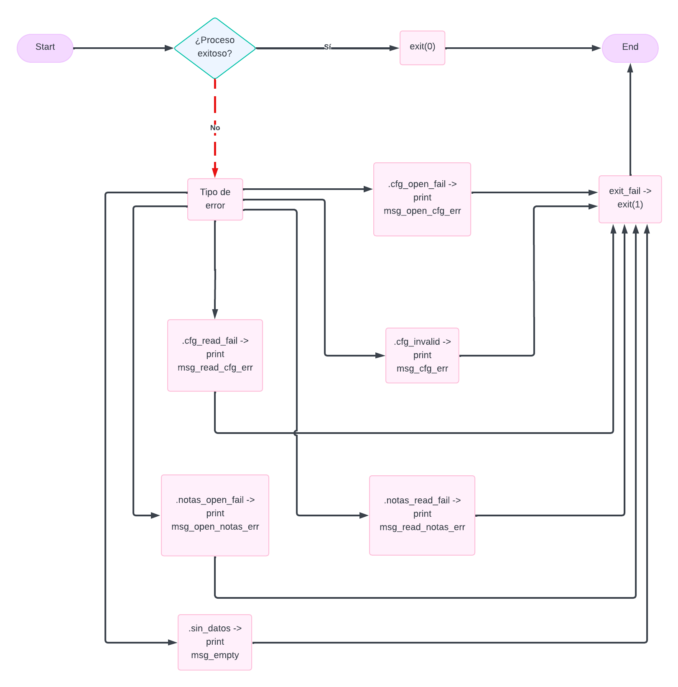

# Statistical Analyzer in x86-64 Assembly

Sistema de análisis estadístico implementado en ensamblador x86-64 que procesa un archivo de notas y genera métricas como media, mediana, moda, desviación estándar y un histograma configurable.

---

## 1. Introducción

El presente proyecto consiste en el desarrollo de un sistema de análisis estadístico implementado en ensamblador x86-64, el cual procesa un archivo de notas y genera métricas como la media, mediana, moda y desviación estándar, además de un histograma configurable. El sistema utiliza un archivo de configuración para definir parámetros como el intervalo de agrupación, el carácter de representación y el color de salida, permitiendo así adaptar la visualización de los resultados.

---

## 2. Objetivos

### 2.1 Objetivo general
Desarrollar un sistema de análisis estadístico en ensamblador x86-64 capaz de leer archivos de configuración y datos, procesar la información de forma eficiente y generar métricas estadísticas junto con un histograma representativo en consola.

### 2.2 Objetivos específicos
- Implementar la lectura y validación de un archivo de configuración que permita parametrizar el comportamiento del sistema. 
- Diseñar un mecanismo de parsing para procesar archivos de datos de manera eficiente, utilizando lectura por bloques. 
- Calcular métricas estadísticas fundamentales como media, mediana, moda y desviación estándar a partir de los datos procesados.  
- Construir un histograma configurable que represente la distribución de las notas según el intervalo definido.
- Construir un histograma configurable que represente la distribución de las notas según el intervalo definido.
- Desarrollar un sistema de impresión en consola que muestre los resultados de forma clara y estructurada, incluyendo soporte para colores mediante códigos ANSI.  

---

## 3. Descripción general del sistema

El sistema opera a partir de dos archivos de entrada: un archivo de configuración (`config.ini`) y un archivo de datos (`notas.txt`). Inicialmente, se lee y valida el archivo de configuración, extrayendo los parámetros necesarios para el funcionamiento del programa. Posteriormente, se realiza la lectura del archivo de notas mediante un enfoque de procesamiento por bloques, identificando y almacenando los valores numéricos correspondientes a cada línea.

Una vez recopilados los datos, el sistema procede al cálculo de las métricas estadísticas principales. En paralelo, se construye un histograma basado en el intervalo definido en la configuración, agrupando las notas en rangos específicos. Finalmente, se genera la salida en consola, donde se presentan las estadísticas calculadas y la representación gráfica del histograma, aplicando el formato y color definidos por el usuario.

Flujo general:

config.ini → lectura y validación → notas.txt → parsing → cálculo estadístico → generación de histograma → impresión

---

## 4. Diagrama de flujo

Aquí se explica el proceso del programa en ensamblador en detalle, con fines de que sea legible se dividirá el diagrama de flujo en 6 partes:
-Inicio e inicialización
-Lectura y validación de `config.ini`
-Lectura de `notas.txt`
-Verificación de datos válidos
-Procesamiento principal
-Salida final y manejo de errores

### 4.1 Inicio e inicalización

Este diagrama representa la etapa inicial del programa, comenzando en el punto de entrada `_start`, donde se realiza la preparación básica antes del procesamiento de datos.
Inicialmente, se inicializa el buffer `char_buf` para asegurar un estado conocido en memoria. Luego, se invoca la subrutina `leer_config`, encargada de abrir, leer y validar el archivo `config.ini`.

El resultado de esta operación se devuelve en el registro `eax`, el cual determina el flujo de ejecución:
- `eax = 0`: la configuración es válida y el programa continúa normalmente.
- `eax = 1`: error al leer el archivo.
- `eax = -2`: archivo leído pero con contenido inválido.
- Otro valor: error al abrir el archivo.

### 4.2 Lectura y validación de `config.ini`

Este diagrama representa la subrutina `leer_config`, encargada de abrir, leer y validar el archivo de configuración `config.ini`.
El proceso inicia con la apertura del archivo mediante la syscall `open`. Si ocurre un error (valor negativo en `rax`), la función retorna `eax = -1`. En caso contrario, se procede a leer su contenido en memoria utilizando `read`. Si esta operación falla, se cierra el archivo y se retorna `eax = 1`.
Una vez leído correctamente, el archivo es cerrado y se inicia el proceso de parsing línea por línea. Durante esta etapa, se ignoran espacios, saltos de línea y comentarios, y se buscan las claves esperadas: `COLOR`, `INTERVALO` y `CARACTER`. Cuando se detecta una clave válida, se parsea su valor correspondiente y se almacena en memoria, marcando además una bandera de validación.

Al finalizar el recorrido del archivo, se verifica que todas las claves hayan sido encontradas y que sus valores cumplan las restricciones establecidas:
- `COLOR` debe estar en el rango de 1 a 4.
- `INTERVALO` debe estar entre 1 y 100.
- `CARACTER` debe ser distinto de cero.

Si alguna de estas condiciones no se cumple, la función retorna `eax = -2`, indicando configuración inválida. En caso contrario, la función finaliza exitosamente retornando `eax = 0`.

### 4.3 Lectura de `notas.txt`

Este diagrama representa la subrutina `leer_notas`, encargada de procesar el archivo `notas.txt` mediante lectura por bloques y parsing carácter por carácter.
Se inicializan las estructuras de datos necesarias: el arreglo de frecuencias (`freq_arr`), acumuladores (`sum_notes`, `notes_count`) y variables de estado del parser (`cur_num`, `in_number`, `line_candidate`, `has_candidate`).
El archivo se abre utilizando la syscall `open`. Si falla, la función retorna `eax = -1`. Luego, se realiza la lectura en bloques de 4096 bytes mediante `read`. Si ocurre un error de lectura, se cierra el archivo y se retorna `eax = 1`.

El contenido leído se procesa byte por byte. Cuando se detectan dígitos (`'0'..'9'`), se construye el número actual utilizando la relación: numero final = numero * 10 + digito

Cuando se encuentra un separador (espacio, tab o salto de línea), el número acumulado se considera como candidato de nota.
Al finalizar cada línea, se evalúa si existe un candidato válido (`has_candidate == 1`) y si cumple las condiciones:
- Valor entre 0 y 100.
- Espacio disponible en el arreglo (máximo 65536 elementos).

Si es válido, se almacena en `notes_arr` y `notes_sorted`, se incrementa el contador de notas, se acumula en `sum_notes` y se actualiza su frecuencia en `freq_arr`.
Caracteres inválidos dentro de una línea descartan el candidato actual, asegurando robustez ante formatos incorrectos.
Al alcanzar el final del archivo (EOF), se procesa una posible última línea pendiente. Finalmente, se cierra el archivo y la función retorna `eax = 0` si todo fue exitoso.

### 4.4 Verificación de datos válidos

Este diagrama representa la verificación posterior a la lectura del archivo `notas.txt`, donde se determina si existen datos válidos para procesar.
Se evalúa el valor de `notes_count`, que corresponde a la cantidad total de notas almacenadas durante la etapa de parsing.

- Si `notes_count = 0`, significa que no se encontraron notas válidas en el archivo. En este caso, el programa imprime un mensaje de error (`msg_empty`) y finaliza con un código de salida de error.
- Si `notes_count > 0`, el programa continúa hacia la etapa de procesamiento principal, donde se calculan las estadísticas y se genera el histograma.

Esta verificación evita realizar cálculos innecesarios y asegura que el sistema opere únicamente sobre datos válidos.

### 4.5 Procesamiento principal

Este diagrama representa la etapa principal del programa, donde se procesan los datos obtenidos del archivo `notas.txt` para generar los resultados finales.
En primer lugar, se invoca la subrutina `calcular_estadisticas`, en la cual se obtienen las métricas principales:
- Media
- Mediana (a partir del ordenamiento de los datos)
- Moda (utilizando el arreglo de frecuencias)
- Desviación estándar

Se llama a `calcular_histograma`, donde se construye la distribución de las notas. Para ello, se determina la cantidad de intervalos (bins), se inicializan los contadores y se asigna cada nota a su rango correspondiente, incrementando su frecuencia.
Finalmente, se ejecuta la subrutina `imprimir_reporte`, encargada de mostrar los resultados en consola. Esta incluye la impresión de las estadísticas calculadas y del histograma, aplicando el color y el carácter definidos en el archivo de configuración.

### 4.6 Salida final y manejo de errores

Este diagrama representa la etapa final del programa, donde se determina si la ejecución fue exitosa o si ocurrió algún error durante el proceso.
Se evalúa el resultado general del sistema:

- Si el proceso fue exitoso, el programa finaliza normalmente mediante `exit(0)`, indicando una ejecución correcta.
- Si ocurrió algún error, se identifica su tipo y se ejecuta la rutina correspondiente de manejo de errores.

Los posibles errores contemplados son:
- Error al abrir el archivo `config.ini`.
- Error al leer el archivo `config.ini`.
- Configuración inválida.
- Error al abrir el archivo `notas.txt`.
- Error al leer el archivo `notas.txt`.
- Ausencia de datos válidos.

En cada caso, se imprime un mensaje específico en consola para informar al usuario sobre la causa del fallo. Posteriormente, el programa finaliza mediante `exit(1)`, indicando que la ejecución terminó con error.

---

## 5. Arquitectura del programa

Descripción de la organización modular del sistema.

Módulos principales:
- _start  
- leer_config  
- leer_notas  
- calcular_estadisticas  
- calcular_histograma  
- imprimir_reporte  

Explicación breve de la función de cada módulo.

---

## 6. Formato de entrada

### 6.1 Archivo de configuración (config.ini)

Ejemplo:

COLOR:1  
INTERVALO:50  
CARACTER:@  

Descripción de cada parámetro, su significado y restricciones.

---

### 6.2 Archivo de datos (notas.txt)

Ejemplo:

Nombre Apellido 85  
Otro Nombre 92  

Descripción del formato de cada línea y del rango de valores permitidos.

---

## 7. Procesamiento de datos

### 7.1 Parsing de configuración

Explicación de cómo se identifican las claves, cómo se leen los valores y cómo se validan.

---

### 7.2 Parsing de notas mediante lectura por bloques

Explicación del enfoque de lectura tipo streaming, manejo de buffers y lógica de procesamiento.

---

### 7.3 Estructuras de almacenamiento

Descripción de las estructuras utilizadas para almacenar y procesar los datos:
- Arreglo de notas  
- Arreglo ordenado  
- Arreglo de frecuencias  
- Arreglo de bins  

---

## 8. Cálculo estadístico

### 8.1 Media

Descripción del cálculo de la media.

---

### 8.2 Mediana

Descripción del método de ordenamiento y el cálculo para casos pares e impares.

---

### 8.3 Moda

Descripción del uso del arreglo de frecuencias para determinar la moda.

---

### 8.4 Desviación estándar

Descripción de la fórmula utilizada y del uso de operaciones en punto flotante.

---

## 9. Generación del histograma

Explicación de cómo se calcula la cantidad de bins, cómo se asignan las notas a cada bin y cómo se manejan los casos límite.

---

## 10. Sistema de impresión

Descripción del mecanismo de impresión, uso de syscalls y funciones auxiliares.

---

## 11. Uso de códigos ANSI

Explicación del uso de códigos ANSI para la representación de colores en la salida.

---

## 12. Manejo de errores

Descripción de los errores contemplados:
- Error al abrir archivos  
- Error al leer archivos  
- Configuración inválida  
- Ausencia de datos válidos  

---

## 13. Pruebas realizadas

Descripción de los distintos tipos de pruebas realizadas:
- Casos normales  
- Casos extremos  
- Casos de error  

---

## 14. Conclusión

Conclusión del proyecto, incluyendo resultados obtenidos, aprendizajes y relevancia del sistema desarrollado.

---
